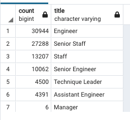
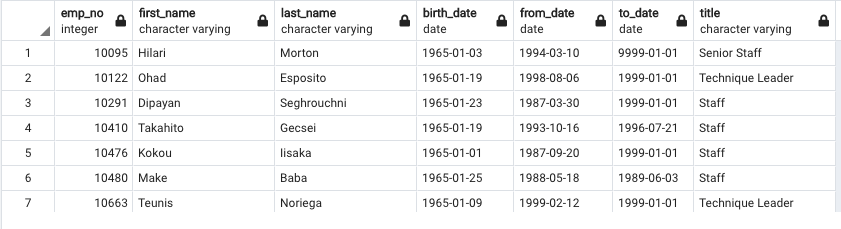

# Pewlett Hackard Analysis
## Overview
The purpose of this project is to help managment determine the number of soon to be retiring employees by their title and identify the ones who are eligible to particapte in a mentorship program. The first queary created was to find employees born bewteen January 1, 1952 and December 31, 1955 and sort them by their titles.  The next query retrieved the emp_no, first_name and last_name columns from the employees table and retrieved the title,from_date and to_date columns of the titles table. Both tables were joined on the primary key, filtered the data by birth_date and put the information into a new table.  For the next two parts of deliverable a unique_titles table was made to find the first occurance of the emp_no in our new table by using the DISTINCT ON function and for the last part of the deliverable we did ORDER BY COUNT to show us the total number of each title from our unique_titles table that was made.   The second deliverable query was created that retrieved columns from our employees and dept_emp table, filtering the data on current employees born in between 1/1/65 and 12/31/65 then organized the order of the table by emp_no.  This last query gives us a list of elgible employees for the mentorship program. 

## Results
With the retirment_titles table we are able to see every eligible employee for retirement and how long they have worked at each position over the course of their career.

The unique_titles table that was created is showing the most recent title for employees of retirment age.

Our retiring_titles shows us the a majority of the employees of retirment age (37,350/90,398 = 41%) have senior titles

 

Fig 1: retirement count by titles 

Fig 2: employees with their titles

This list below is the employees that are elgible for the mentorship program.

## Summary
